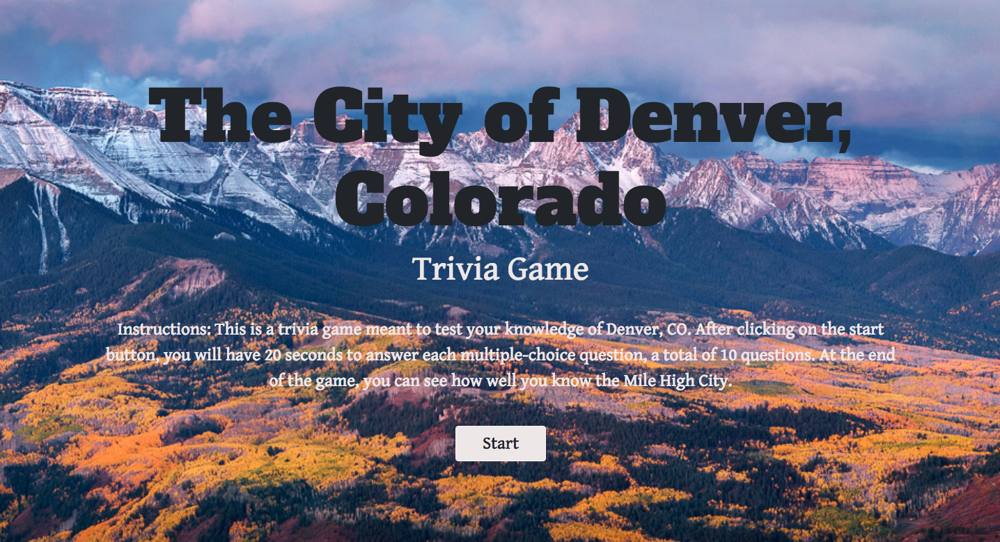

## TriviaGame
Description: A Denver, CO themed trivia game that displays 8 multiple-choice questions, one a time, and allows the user 15 seconds to answer each question.

Directions: Select the start button to begin the trivia game. You will have 15 seconds to answer each question, select the multiple choice answer you believe is correct. The correct answer will be displayed if you run out of time. At the end of the 8 questions, you will receive a summary of how well you did - how many questions you answered correctly, incorrectly, and how many you ran out of time. You will also be given a chance to play the game again. 

______________
______________
______________
## Visit the deployed version of the Trivia Game
[Trivia Game](https://oserenchenko.github.io/TriviaGame/)



______________
______________
______________

## Getting Started
to install locally run this command in your terminal
```
git clone https://github.com/oserenchenko/TriviaGame.git
```
once inside the TriviaGame folder, open the index.html file in your preferred web browser.

## Built With
* HTML - website structure
* [CSS](https://css-tricks.com/) - styling
* [Bootstrap](https://getbootstrap.com/) - styling framework
* [Javascript](https://www.javascript.com/) - website logic
* [jQuery](https://jquery.com/) - manipulating the DOM

______________
______________
______________
## Authors
* [Olga Serenchenko](https://github.com/oserenchenko)

______________
______________
______________
## License
This project is licensed under the MIT License - see the [LICENSE.md](LICENSE.md) file for details
